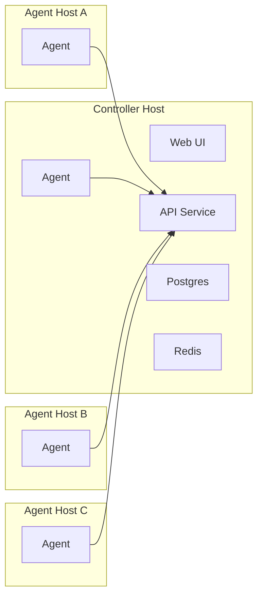
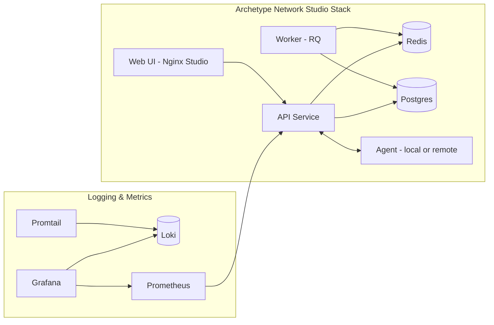
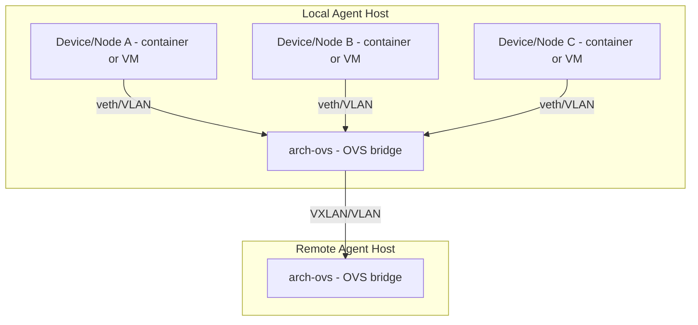

<p align="center">
  
</p>

# Archetype Network Studio

Archetype Network Studio is a lab orchestration stack for building, running, and managing virtual network topologies with a web-based studio, API, and agents.

## Quick Start (Recommended)

We recommend Debian for installation and testing.

### Install Overview

- Run the controller install once on a single host. This host runs the Web UI + API + DB + Redis.
- Install agents on one or more additional hosts. Agents connect back to the controller URL.



### Install Commands

1. Install the controller (run once on a single host):

```bash
curl -fsSL https://raw.githubusercontent.com/riannom/archetype-iac/main/install.sh | \
  sudo bash -s -- --controller
```

This sets up the Web UI, API, database, and Redis on the controller host.

2. Install agents on other hosts (repeat per agent host):

```bash
curl -fsSL https://raw.githubusercontent.com/riannom/archetype-iac/main/install.sh | \
  sudo bash -s -- --agent --controller-url http://<controller-host>:8000 --name <agent-name>
```

Replace `<controller-host>` with the reachable IP or DNS name of the host where you installed the controller, and set `--name` to the agent name you want to see in the controller UI.

You can also set the VXLAN IP explicitly if needed:

```bash
curl -fsSL https://raw.githubusercontent.com/riannom/archetype-iac/main/install.sh | \
  sudo bash -s -- --agent --controller-url http://<controller-host>:8000 --name <agent-name> --ip <agent-ip>
```

## Architecture

Archetype IaC is composed of three main layers:

- **Web UI (Studio)**: The user-facing interface for building and managing labs.
- **API Service**: Central controller that exposes endpoints for lab management, vendors, images, and operations.
- **Agents**: Host-side workers that execute lab operations, manage containers/VMs, and report status.

The UI talks to the API, and the API coordinates with agents to perform lab actions. This separation keeps the UI and backend loosely coupled and enables multi-host deployments.

### Container Layout (docker-compose.gui.yml)



### Agent Networking (per host)

Each agent host runs a single OVS bridge (`arch-ovs`). Containers and VMs connect to that bridge via veth pairs, and VLAN tags provide per-link isolation. Cross-host links use VXLAN on the same shared bridge.



### Mapping & State

The API maintains lab state in Postgres and uses Redis for job coordination and eventing. Interface mappings include OVS port and bridge metadata so the API can validate and reconcile links with the agent’s reported OVS state.

## Observability Operations

Use the non-prod maintenance bundle to produce periodic canary, DB, and link-reservation drift logs:

```bash
./scripts/run_observability_maintenance_nonprod.sh
```

This writes timestamped artifacts under `reports/observability/`, including:

- `canary_<timestamp>.log`
- `db_report_<timestamp>.log`
- `link_reservation_drift_<timestamp>.log`

Nightly gate recommendation for hot-connect reliability:

1. Require `RESULT=PASS` in the latest `link_reservation_drift_*.log`.
2. Require `missing_reservations=0`, `orphaned_reservations=0`, and `conflicting_endpoints=0`.
3. If gate fails, run link reservation health inspection via `GET /system/link-reservations/health` and triage before business-hours changes.

## Supported Vendors and Device Kinds

The supported device catalog is served dynamically from the API (`/vendors`) and sourced from `agent/vendors.py`. Current vendor coverage includes:

| Vendor | Device Kinds |
| --- | --- |
| Arista | `ceos` |
| Cisco | `cat-sdwan-controller`, `cat-sdwan-manager`, `cat-sdwan-validator`, `cat-sdwan-vedge`, `cisco_asav`, `cisco_c8000v`, `cisco_cat9kv`, `cisco_csr1000v`, `cisco_ftdv`, `cisco_iosv`, `cisco_iosxr`, `cisco_n9kv`, `cisco_xrd`, `fmcv` |
| Citrix | `citrix_adc` |
| F5 | `f5_bigip` |
| Fortinet | `fortinet_fortigate` |
| Juniper | `juniper_crpd`, `juniper_vjunosrouter`, `juniper_vjunosswitch`, `juniper_vqfx`, `juniper_vsrx3` |
| Microsoft | `windows` |
| NVIDIA | `cvx` |
| Nokia | `nokia_srlinux` |
| Open Source | `linux` |
| Palo Alto | `paloalto_vmseries` |
| SONiC | `sonic-vs` |
| VyOS | `vyos` |

## Screenshots

Below are a few snapshots of the Studio UI and system views to give a sense of the workflow and available panels.

Studio canvas overview.


Device palette and configuration.


Logs and task activity panel.


System status and image management.


Theme selection and styling options.

