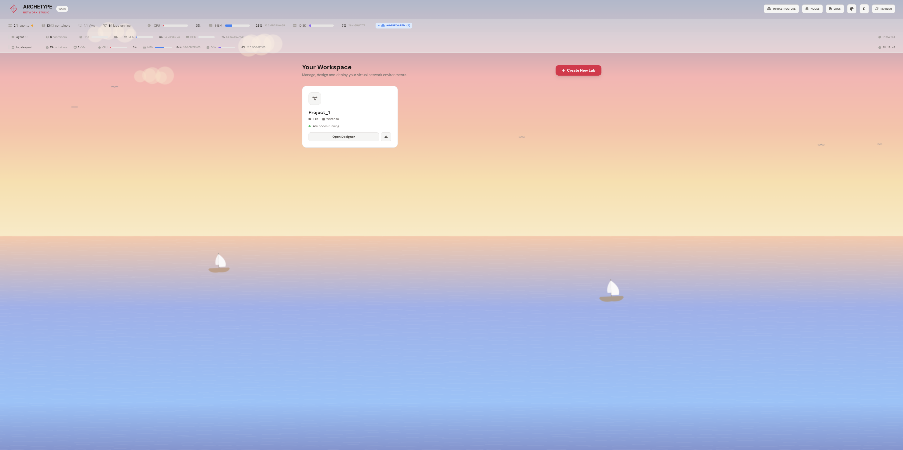
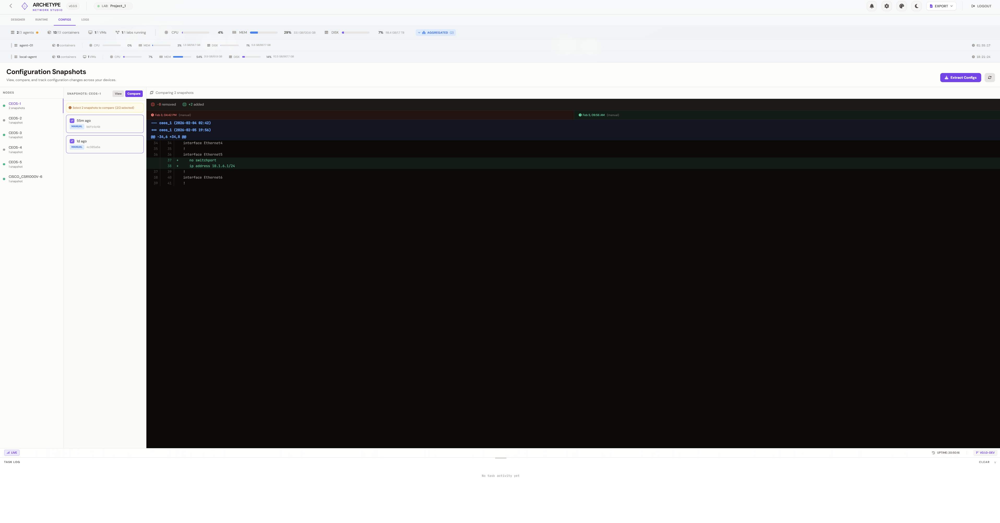
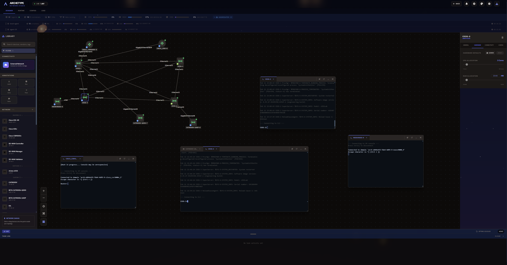
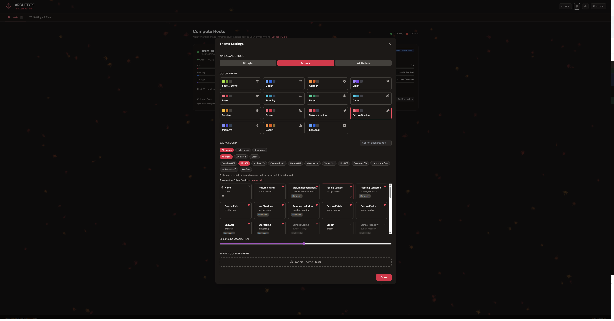

<p align="center">
  
</p>

# Archetype Network Studio

Archetype Network Studio is a lab orchestration stack for building, running, and managing virtual network topologies with a web-based studio, API, and agents.

## Quick Start (Recommended)

We recommend Debian for installation and testing.

1. Clone the repo and run the installer:

```bash
./install.sh
```

The installer handles required dependencies and sets up the stack.

## Architecture

Archetype IaC is composed of three main layers:

- **Web UI (Studio)**: The user-facing interface for building and managing labs.
- **API Service**: Central controller that exposes endpoints for lab management, vendors, images, and operations.
- **Agents**: Host-side workers that execute lab operations, manage containers/VMs, and report status.

The UI talks to the API, and the API coordinates with agents to perform lab actions. This separation keeps the UI and backend loosely coupled and enables multi-host deployments.

### Container Layout (docker-compose.gui.yml)

```mermaid
flowchart LR
  subgraph Stack["Archetype Network Studio Stack"]
    web[Web UI\n(Nginx + Studio)] --> api[API Service]
    worker[Worker\n(RQ)] --> redis[(Redis)]
    worker --> postgres[(Postgres)]
    api --> postgres
    api --> redis
    api <--> agent[Agent\n(local or remote)]
  end

  subgraph Observability["Logging & Metrics"]
    promtail[Promtail] --> loki[(Loki)]
    grafana[Grafana] --> loki
    prometheus[Prometheus] --> api
    grafana --> prometheus
  end
```

### Agent Networking (per host)

Each agent host runs a single OVS bridge (`arch-ovs`). Containers and VMs connect to that bridge via veth pairs, and VLAN tags provide per-link isolation. Cross-host links use VXLAN on the same shared bridge.

```mermaid
flowchart TB
  subgraph Host["Agent Host"]
    ovs[arch-ovs\n(OVS bridge)]
    c1[Device/Node A\n(container or VM)]
    c2[Device/Node B\n(container or VM)]
    c3[Device/Node C\n(container or VM)]
    c1 -- veth/VLAN --> ovs
    c2 -- veth/VLAN --> ovs
    c3 -- veth/VLAN --> ovs
    ovs -- VXLAN/VLAN --> remote[Remote Agent Host]
  end
```

### Mapping & State

The API maintains lab state in Postgres and uses Redis for job coordination and eventing. Interface mappings include OVS port and bridge metadata so the API can validate and reconcile links with the agent’s reported OVS state.

## Supported Vendors and Device Kinds

The supported device catalog is served dynamically from the API (`/vendors`) and sourced from `agent/vendors.py`. Current vendor coverage includes:

| Vendor | Device Kinds |
| --- | --- |
| Arista | `ceos` |
| Cisco | `cat-sdwan-controller`, `cat-sdwan-manager`, `cat-sdwan-validator`, `cat-sdwan-vedge`, `cisco_asav`, `cisco_c8000v`, `cisco_cat9kv`, `cisco_csr1000v`, `cisco_ftdv`, `cisco_iosv`, `cisco_iosxr`, `cisco_n9kv`, `cisco_xrd`, `fmcv` |
| Citrix | `citrix_adc` |
| F5 | `f5_bigip` |
| Fortinet | `fortinet_fortigate` |
| Juniper | `juniper_crpd`, `juniper_vjunosswitch`, `juniper_vqfx`, `juniper_vsrx3` |
| Microsoft | `windows` |
| NVIDIA | `cvx` |
| Nokia | `nokia_srlinux` |
| Open Source | `linux` |
| Palo Alto | `paloalto_vmseries` |
| SONiC | `sonic-vs` |
| VyOS | `vyos` |

## Tested So Far

- Primary install path: `./install.sh` on Debian (recommended).
- Device image availability and licensing are vendor-specific and depend on user-provided images.

## Screenshots

Below are a few snapshots of the Studio UI and system views to give a sense of the workflow and available panels.

Studio canvas overview.


Device palette and configuration.


Logs and task activity panel.


System status and image management.


Theme selection and styling options.


## Development

There is no single unified dev command yet. Use the existing install and service scripts as appropriate for your environment.

## Testing

A coverage map script is available:

```bash
python3 scripts/coverage_map.py
```

This generates reports under `reports/`.

## Notes

- When UI or API changes affect running containers, rebuild and restart the Docker Compose stack using:

```bash
docker compose -f docker-compose.gui.yml up -d --build
```
